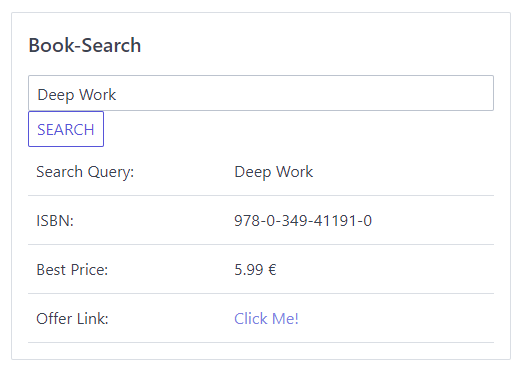

# Nextjs Book Search Example

This library is an example implementation for [Book Search](https://github.com/fheutz/book-search)



# Run it locally

Run the following commands on your machine

```bash
# Install the dependencies
npm install 

# Run the development server
npm run dev

# then visit http://localhost:3000
```

# Limitations

This Example Implementation takes the First ISBN it finds for a booktitle and looks for German € prices. For this most of the time you should get the same shop with the best price. Try Looking for some rare books like an old Lord Of the Rings, this should bring up some other search results 👍